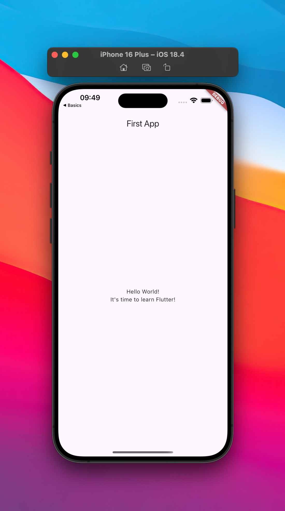

# First Project App

This First Project App is the first project I built while following the first chapter of the [Flutter &amp; Dart - The Complete Guide [2025 Edition]](https://www.udemy.com/course/learn-flutter-dart-to-build-ios-android-apps/) Udemy course.

  

### What I learned during this chapter:

-   What is Flutter and Dart and how to install/setup.
-   Understanding Material Design.
-   Running a First Flutter App.
