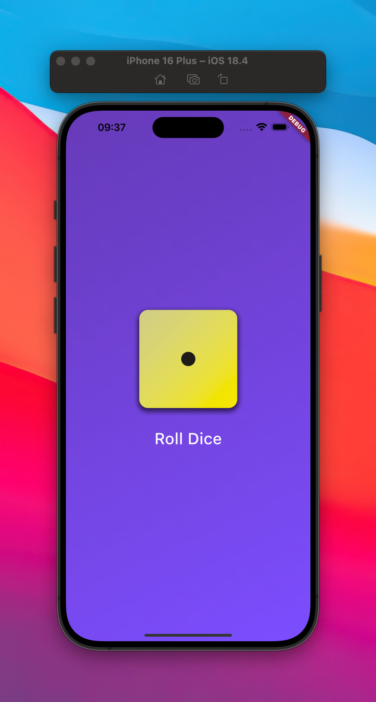

# Dice Roller App

This Flutter Dice Roller App is the second project I built while following the second chapter of the [Flutter & Dart - The Complete Guide [2025 Edition]](https://www.udemy.com/course/learn-flutter-dart-to-build-ios-android-apps/) Udemy course.

  

### What I learned during this chapter:

-   Importing packages.
-   Running a Flutter app on an emulator.
-   Using `StatelessWidget` and `StatefulWidget`.
-   Building constructors in classes.
-   Adding assets to `pubspec.yaml`.
-   Basic styling (background and elements).
-   Building widgets in separate files and nesting them.
-   Using `setState` with anonymous functions to trigger dynamic UI changes.
-   Generating random numbers.
-   Basic app optimization.
-   Displaying images.
