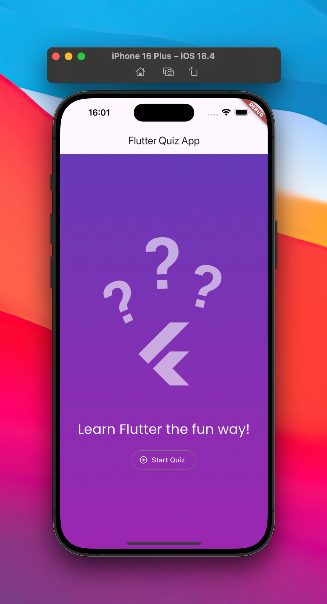
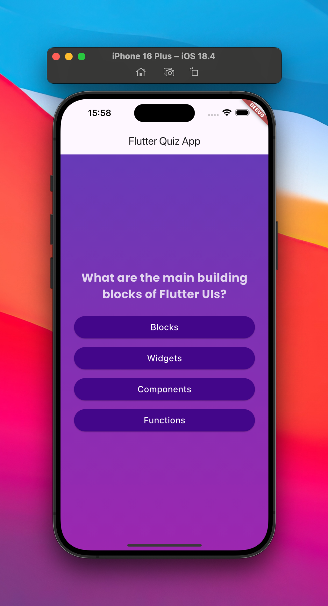
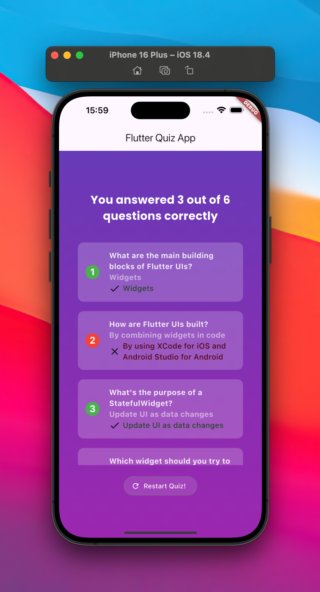

# Quiz App

This Quiz App is the third project I built while following the third chapter of the [Flutter &amp; Dart - The Complete Guide [2025 Edition]](https://www.udemy.com/course/learn-flutter-dart-to-build-ios-android-apps/) Udemy course.

  
  
  

### What I learned during this chapter:

-   Repetition of material from previous lessons.
-   `AppBar` implementation.
-   Adding icon to the `OutlinedButton`.
-   Applying transparency to an image.
-   Rendering Content Conditionally.
-   The "initState" Method.
-   Creating a Reusable, Custom Styled Button.
-   Mapping Lists & Using the Spread Operator.
-   Mutating Values in Memory.
-   Using Third-Party Packages & Adding Google Fonts.
-   Passing Data via Functions Across Widgets.
-   Maps & "for" Loops.
-   Using "Type Casting".
-   Combining Columns & Rows.
-   Using `Expanded` widget to inherit widget size from parent widget (for Columns and Rows).
-   Making Content Scrollable with SingleChildScrollView.
-   Using getters in Dart.
-   Using arrows functions.
