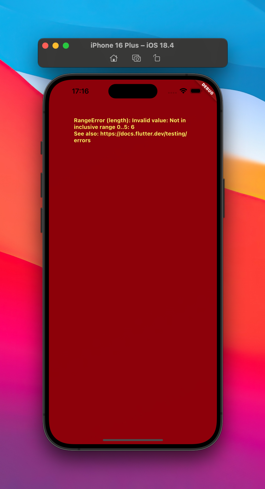

# Quiz App - Fixed Errors

This app is the fourth project I created while completing the fourth chapter of the[Flutter & Dart - The Complete Guide [2025 Edition]](https://www.udemy.com/course/learn-flutter-dart-to-build-ios-android-apps/) Udemy course.

| Before | After |
|:---:|:---:|
|  |  |
|  |  |

### What I learned during this chapter:

-   Understanding Error Messages
-   Debugging Apps & Using "Debug Mode"
-   Working with the Flutter DevTools
-   Running the App on Real iOS or Android Devices