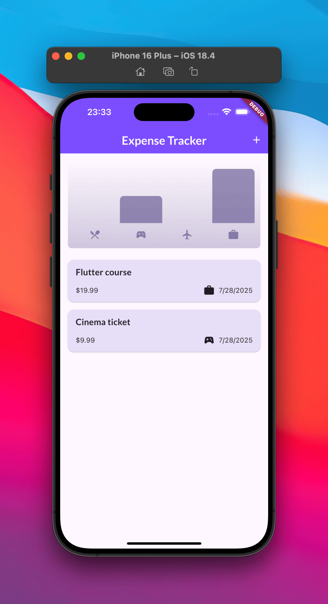

# Expense Tracker App

A comprehensive Flutter application for tracking personal expenses with an intuitive interface, dark mode support, and responsive design. This project demonstrates modern Flutter development practices and UI/UX design principles.

## About

This Expense Tracker App is the fifth project I built while following the fifth and sixth chapters of the [Flutter & Dart - The Complete Guide [2025 Edition]](https://www.udemy.com/course/learn-flutter-dart-to-build-ios-android-apps/) Udemy course.

## Features

### Core Functionality

-   **Add Expenses**: Create new expense entries with title, amount, date, and category
-   **Edit Expenses**: Modify existing expense entries (custom feature implementation)
-   **Delete Expenses**: Remove expenses with swipe-to-dismiss functionality
-   **Expense Categories**: Organize expenses into predefined categories (Food, Travel, Leisure, Work)
-   **Date Selection**: Built-in date picker for accurate expense tracking
-   **Data Validation**: Input validation with user-friendly error messages

### User Interface

-   **Responsive Design**: Adaptive layout that works in both portrait and landscape orientations
-   **Dark Mode Support**: Seamless switching between light and dark themes
-   **Custom Theming**: Beautiful color schemes with Google Fonts integration
-   **Interactive Charts**: Visual representation of expense data by category
-   **Material Design**: Modern UI following Material Design guidelines
-   **Snackbar Notifications**: User feedback for actions like adding/deleting expenses

### Technical Features

-   **UUID Generation**: Unique identifiers for each expense entry
-   **Date Formatting**: Localized date display using the `intl` package
-   **Modal Sheets**: Elegant overlay interfaces for adding/editing expenses
-   **ListView Implementation**: Efficient scrolling for large expense lists
-   **Safe Area Handling**: Proper UI adaptation for different screen sizes and system overlays

---

## Screenshots

### Light Mode

|                          Main Screen (With Expenses)                           |                               Main Screen (Empty)                               |                                  Add Expense                                   |
| :----------------------------------------------------------------------------: | :-----------------------------------------------------------------------------: | :----------------------------------------------------------------------------: |
|  |  |  |

### Dark Mode

|                                  Main Screen                                  |                                  Add Expense                                  |
| :---------------------------------------------------------------------------: | :---------------------------------------------------------------------------: |
|  |  |

### Additional Features

|                               Validation Error                                |                                Landscape Mode                                |
| :---------------------------------------------------------------------------: | :--------------------------------------------------------------------------: |
|  |  |

---

### What I learned during this chapter:

-   Using the `uuid` package to generate new individual identifiers.
-   Using `enum` for defining a set of named constants.
-   Rendering Long Lists with `ListView` and `build` method for scrolling.
-   Creating a Custom List Item with the Card & Spacer Widgets.
-   Formatting Dates using `intl` package.
-   Setting an `AppBar` with a Title & Actions.
-   Adding a Modal Sheet & Understanding Context.
-   Handling User (Text) Input with the TextField Widget.
-   Using `TextEditingController` to controlling and storing data from the inputs.
-   Closing The Modal with `Navigator.pop` method.
-   Showing a Date Picker.
-   Working with "Futures" for Handling Data from the Future.
-   Adding a Dropdown Button.
-   Validating User Input & Showing an Error Dialog.
-   Using the Dismissible Widget.
-   Showing & Managing "Snackbars"**.**
-   Theming, Setting & Using a Color Scheme, Setting Text Themes, Using Theme Data in Widgets.
-   Adding Dark Mode.
-   Using `for-in` loop.
-   Adding Alternative Constructor Functions.
-   Adding Chart Widgets.
-   Locking the Device Orientiation.
-   Updating the UI based on the Available Space.
-   Handling to Screen Overlays like the Soft Keyboard.
-   Understanding "Safe Areas"
-   Using the LayoutBuilder Widget.
-   Building Adaptive Widgets.
-   Learned during the implementation of my own new feature—editing existing expenses:

    -   Use the `GestureDetector` widget to add a click action for a specific widget.
    -   Use the `late` keyword to initialize a variable only when it is first used.
    -   Using Closure in callback.
